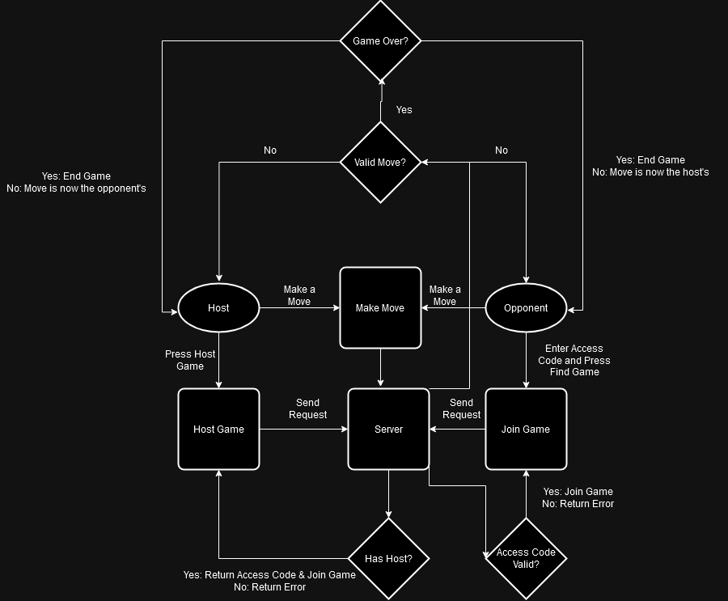

# Java Documentation
## UML Diagram of System

## Breakdown of UML

### FileHandler.java
This class is responsible for handling files included in an HTTP response. The class implements the "HttpHandler" interface provided by the com.sun.net.httpserver import.

#### Methods
- `getPath(HttpExchange)`
  - This abstract method defines a method for subclasses to implement to determine the path of a file included in the HTTP response.
- `handle(HttpExchange)`
  - This method handles HTTP requests, by returning a 200 response if requested file exists and a 404 response if the file path is not found.

#### StaticHandler.java & TemplateHandler.java
StaticHandler and TemplateHandler are extensions of the FileHandler class, and implement the getPath method to determine the file path from the HttpExchange. 

### Utils.java
The Utils class provides a variety of utility methods for use within other classes. These methods simplify complicated process such as generating access codes.

#### Methods
- `getAlphaNumericString(int n)`
   - This method generates an alphanumeric string of length n, to be used as an access code. This code is generated when a user starts to host a game. The string is a random combinations of numbers and letters.
   - The length of the string n is received as a parameter
   - exchangeToParamMap(HttpExchange)
  - This method extracts the URL parameters from HttpExchange objects.
- `mapToJSONString(Map<String, Object>)`
  - This method converts a map into a JSON string. This method is used to send responses in HttpErrors.java
- `tryToClose(Closeable o)`
  - This method will close closeable objects and ignore exceptions that may occur when closing them. This is used when a game is completed to dispose of the host and opponent player.
- `handleGet(HttpHandler)`
   - This method ensures the all HTTP requests are GET, as no other types or in use.
 - `getOrThrow(Optional, String)`
    - This method will try to retrieve an optional object, or throw a 400 error if the optional item does not exist.
  - `sendSuccess(HttpExchange, Map<String, Object>`
     - This method returns a 200 OK response along with a body
   - `sendSseStream(HttpExchange)`
      - This method sets the correct headers for a server-sent event stream.
  - `sendResponse`
     - This method sends an HTTP response of either 200 or 400 across the HttpExchange

### HttpErrors.java
This class defines different HTTP errors that the server can return.
1. HTTPError400: This error is returned when a bad request is made. For example, invalid input parameters in the request.
2. HTTPError405: Invalid request, For example sending a POST or DELETE request.

#### Methods
- `withErrorHandler(HttpHandler)` 
    - This method wraps an HTTPHandler in a try catch block, making it such that when an error is thrown it is subequently caught, and handled.

### Game.java
The game class stores information related to a single game of Tic-Tac-Toe. This includes the state of the board, the access code, results, and who is playing.

#### Methods
- `play(Player, int x, int y)`
    - This method allows the given player to place their marker at the given x or y position. The method will check terms such as if it is their turn, and if there is a placement conflict. If no errors are found, then the game will add their marker to the board.
- `hasHost() & hasOpponent()`
    - These methods check if the game currently has a host or an opponent, these must return true for a game to be played.
- `setHost(host) & setOpponent(opponent)`
    - These methods set the players for the game.
- `dispose()`
    - Once the game is complete, dispose of the players from the game
- `checkFinished()`
    - This method checks if the game has been completed, either by a win or a stalemate.
- `checkWon(State)`
    - This method will check if a given marker (State) has won the game, by having a line of 3 either horizontally, vertically, or diagonally on the board.

### GameManager.java
This class handles managing the flow of the game. It provides methods to configure a game, as well as interacting with the Game.java class to allow players to move.

#### Methods 
- `searchForGame(HttpExchange)`
    - This method is called to check if the access code in the given request exists within the server, and returns the corresponding game code.
- `joinAsHost(HttpExchange) & joinAsOpponent(HttpExchange)`
    - These methods allow a host or opponent to join a game using a game code provided in the HttpExchange. Once a game is joined, a Game object is created for both players.
- `move(HttpExchange)`
    - This method allows a player to make a move through an HTTP Request, with their provided playerID, marker, and xy coordinates. This will use play from the game class to complete the move, or return an error response if the move is invalid.
- `parseOrThrow(String, String)`
    - This method parses a move into an integer, or returns a 400 response if the move is invalid.
- `getGameCodeOrThrow(HTTPExchange)`
    - This method will check if the request contains a gamecode. If it does not, a 400 response is returned. Otherwise, the code is returned.
- `getGameOrThrow(String)`
    - This method checks if the provided gamecode exists in the list of ongoing games, if it is then the game is returned to allow a player to join. If it does not exist, a 400 response is returned
- `dispose()`
    - This method disposes of games when they are complete.

### Main.java
This class configures the game by creating a game manager, and a Server for endpoints. These endpoints are described in the API Specification.

# Front End Documentation

## Control Flow Diagram
Below is a diagram represting a flow of HTTP request when the game is being played. 

> Note that The circles represent the players, squares represent method usage, and diamonds represent choice trees.

### Breakdown of System
The front end is built using a combination of HTML, CSS, and Javascript. 

The CSS uses bootstrap to provide simplified and expanded options for in-line CSS styling.

The display of the game is handled in `index.html` and `index.js` handles interaction with the system, such as processing user input, issuing and receiving HTTP requests, and displaying errors.

#### Methods
- `disableConnectionButton()`
    - This method will disable connection buttons when a player joins a game.
- `enableConnectionButton()`
    - This method will enable connection buttons to allow a player to host or join a game.
- `hostGame()`
    - This method will issue an HTTP request to the server to retrieve an access code and start a game. If successful, the access code is displayed, and the player waits for an opponent to join
- `findGame()`
    - This method will issue an HTTP request to the server with an access code to let an opponent player join a game. If it is successful, connection buttles are disabled and the game begins.
- `placeMarker(x,y,state)`
    - This method allows a player to place a marker on the board by editing the view of the display to add the marker. This is called when a successful move is made.
- `makePlay(x,y)`
    - This method will issue an HTTP request to the server to attempt to play a move at the given x,y position. if invalid, an error is displayed. When successful, the player's marker is added to the board
- `resetGame()`
    - This method will reset the game to the beginning, by clearing the board, and resetting connections.
- `get(url, onSuccess)`
    - This method handles issuing get requests to the server, as well as handling the responses when they are returned.

